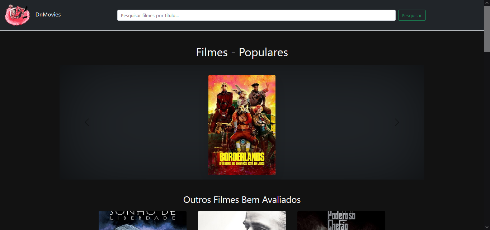
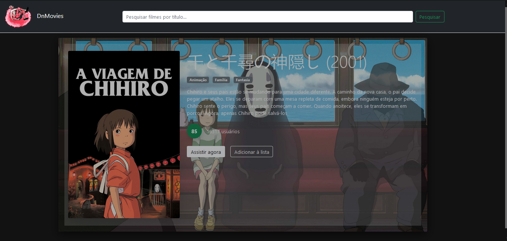

# DnMovies

DnMovies é uma aplicação web criada  para explorar e visualizar informações sobre filmes populares e bem avaliados. A aplicação permite que os usuários pesquisem filmes, vejam detalhes e adicionem filmes à sua lista de favoritos.

<h3>Tecnologias Usadas</h3>

- **ASP.NET Core**: Framework principal para desenvolvimento da aplicação web.
- **Razor Pages**: Para renderização de páginas dinâmicas.
- **Refit**: Para chamadas de API RESTful.
- **Newtonsoft.Json**: Para manipulação de JSON.
- **Bootstrap**: Para estilização.

  

  

## Features

- **Exploração de Filmes**: Veja filmes populares e bem avaliados.
- **Pesquisa de Filmes**: Pesquise por filmes específicos.
- **Detalhes do Filme**: Veja informações detalhadas sobre um filme, incluindo sinopse, gêneros, e avaliação.
- **Adicionar à Lista**: Adicione filmes à sua lista de favoritos.

## Como Executar

1. Clone o repositório: 

        git clone https://github.com/Dinizim/DnMovies.git

2. Navegue até o diretório do projeto:

        cd DnMovies

3. Restaure as dependências e execute a aplicação:

        dotnet restore
        dotnet run

## Contribuição

Contribuições são bem-vindas! Sinta-se à vontade para abrir uma issue ou enviar um pull request.

## Licença

Este projeto está licenciado sob a licença MIT. Veja o arquivo [LICENSE](LICENSE.md) para mais detalhes.

    